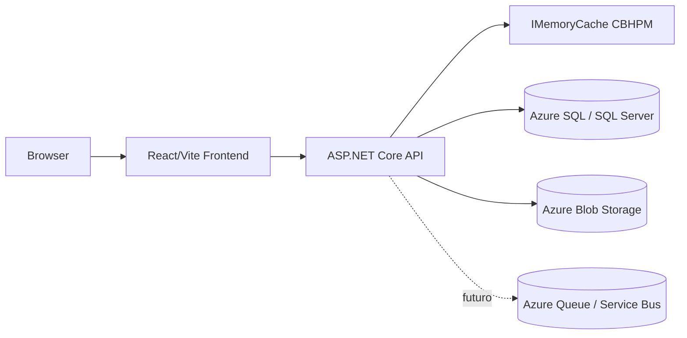
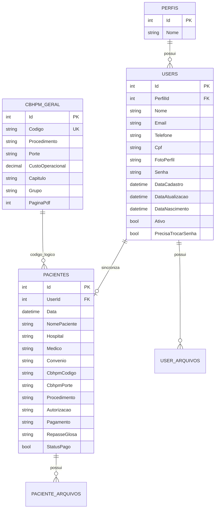
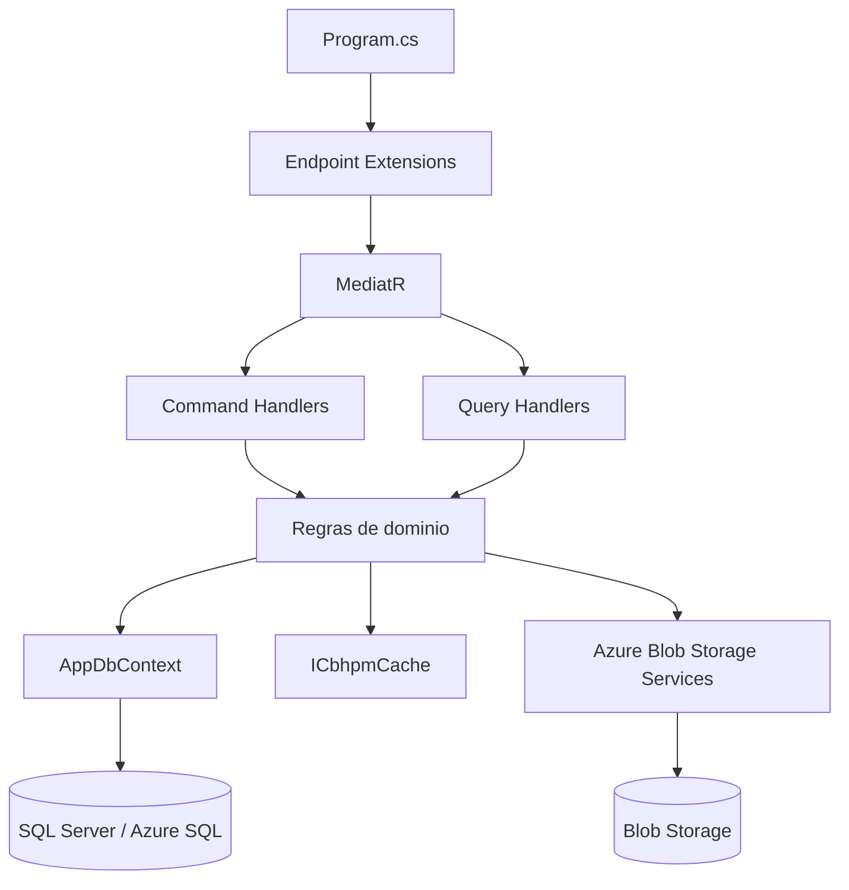
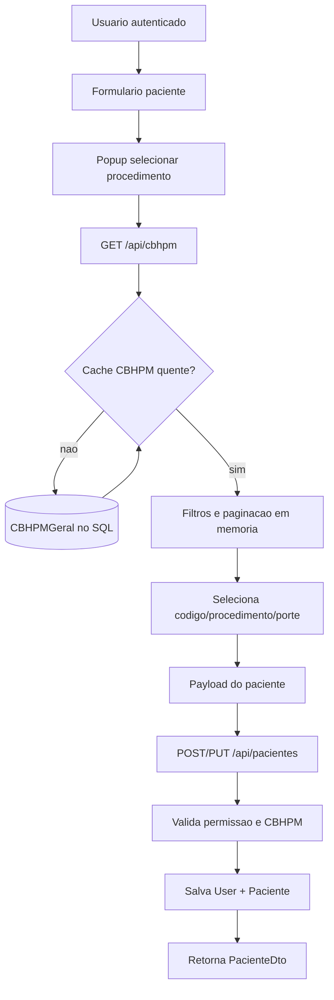
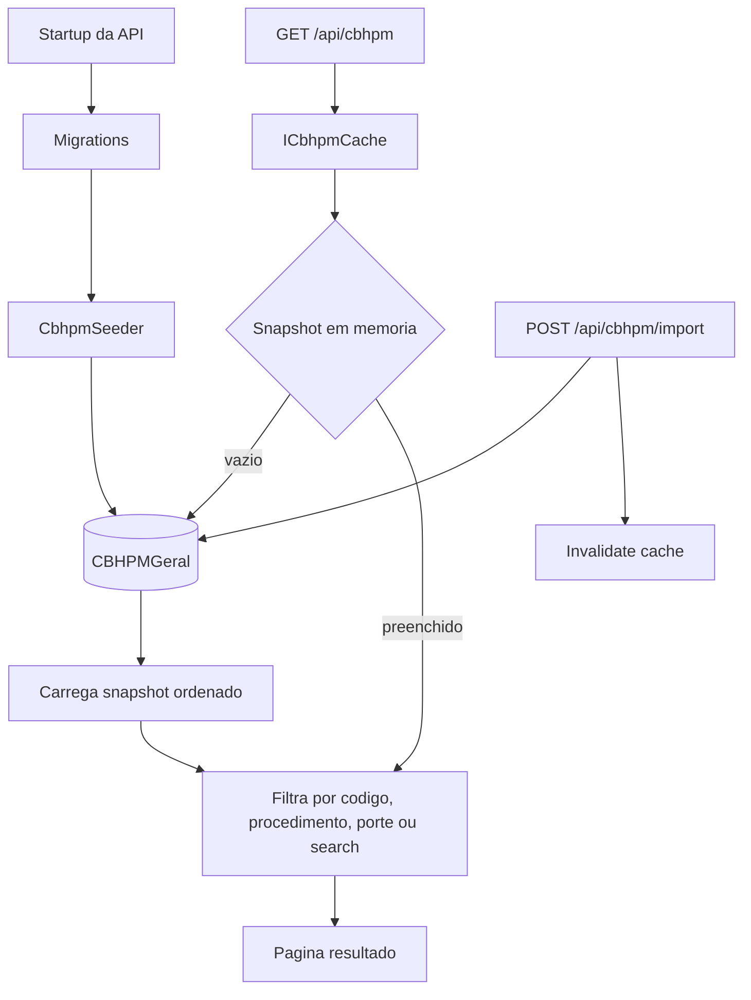
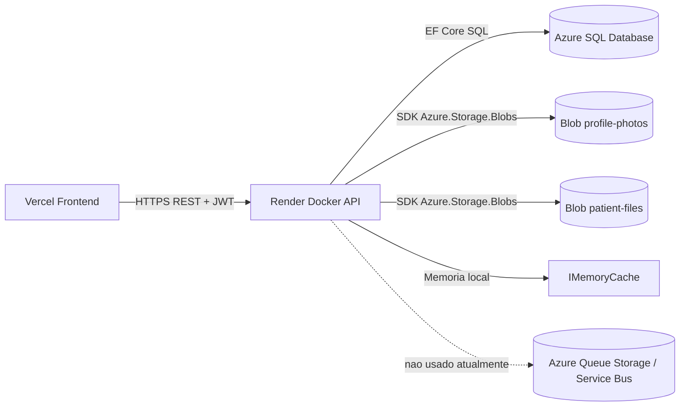

# Hemodinks - Documentacao Tecnica

## Visao geral

O Hemodinks e composto por um frontend React/Vite, uma API ASP.NET Core/.NET 10, persistencia em SQL Server/Azure SQL e armazenamento de arquivos em Azure Blob Storage.

URLs principais:

| Recurso | URL |
| --- | --- |
| Frontend local | `http://localhost:5173` |
| Frontend producao | `https://hemodinks-saude.vercel.app` |
| API local | `http://localhost:5000` |
| Swagger | `/swagger` |
| Scalar | `/scalar` |
| OpenAPI JSON | `/openapi/v1.json` |

## Componentes

## MER

## Fluxo de classes do backend

## Fluxo de cadastro/edicao de paciente

## Fluxo de CBHPM

## Comunicacao com Azure

## Recursos Azure usados

| Recurso | Status | Uso |
| --- | --- | --- |
| Azure SQL Database | usado | banco relacional da aplicacao |
| Azure Blob Storage | usado | fotos e anexos |
| Azure Queue Storage / Service Bus | nao usado | reservado para funcionalidades assincronas futuras |

## Observacoes operacionais

- `IMemoryCache` reduz leituras repetidas da tabela CBHPM, mas e cache local por instancia.
- Azure SQL e Blob Storage sao recursos externos cobrados conforme plano/uso.
- Azure Queue nao gera custo neste projeto enquanto nao for criado/usado.
- Swagger e Scalar estao publicados em todos os ambientes para facilitar validacao e integracao.
