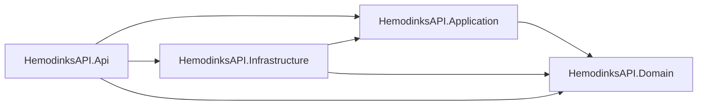
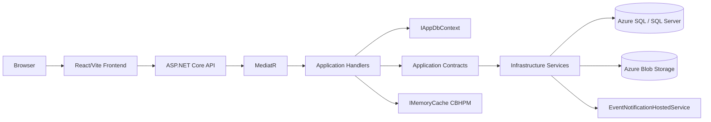
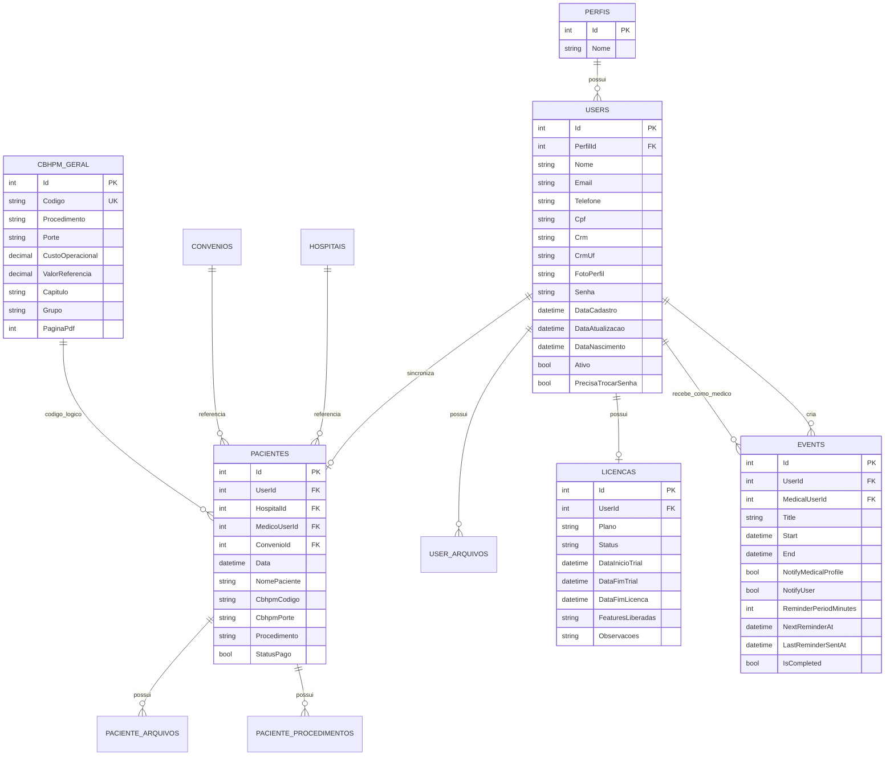
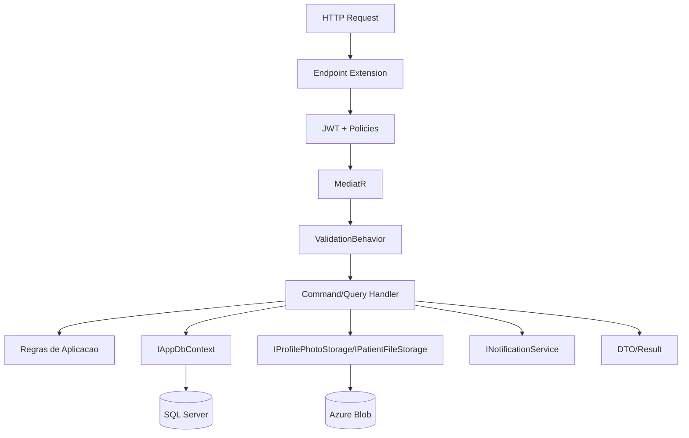
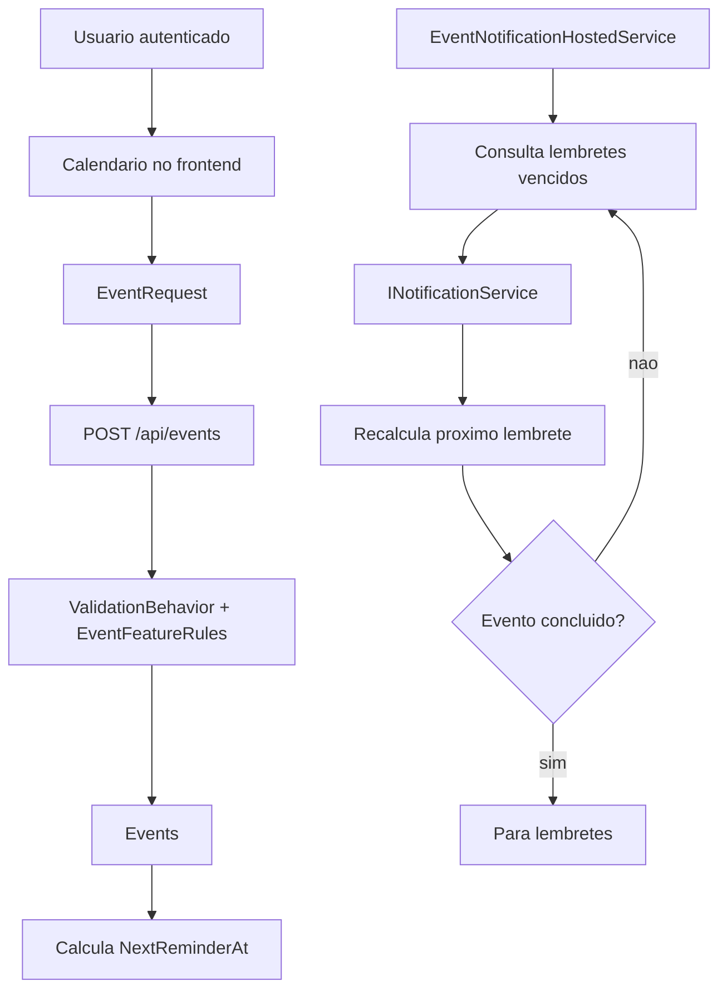
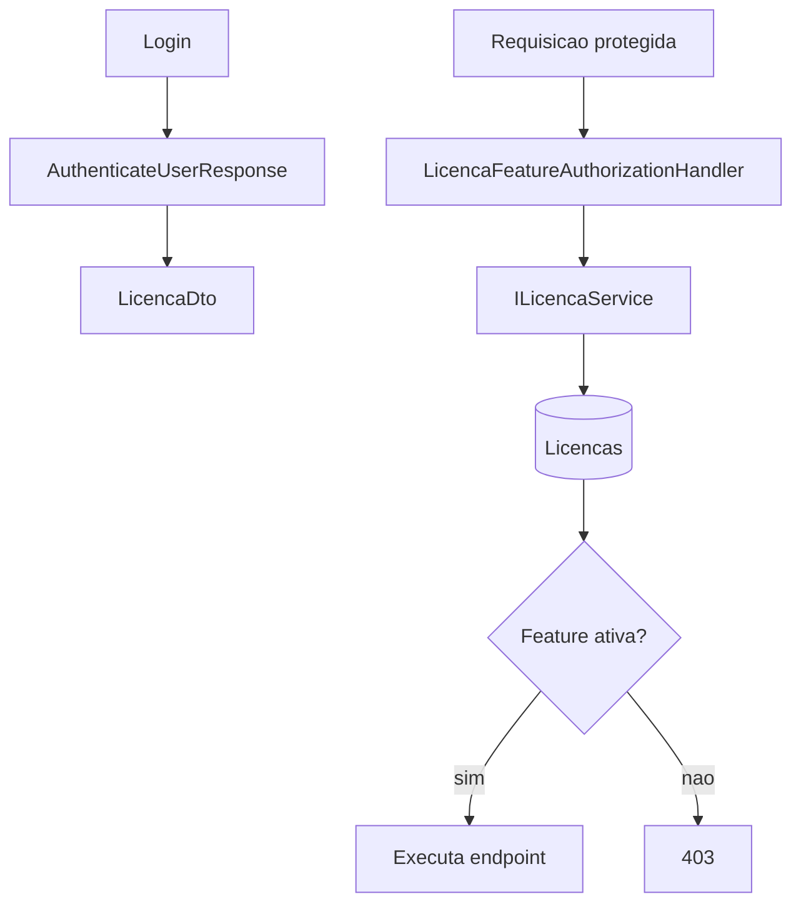
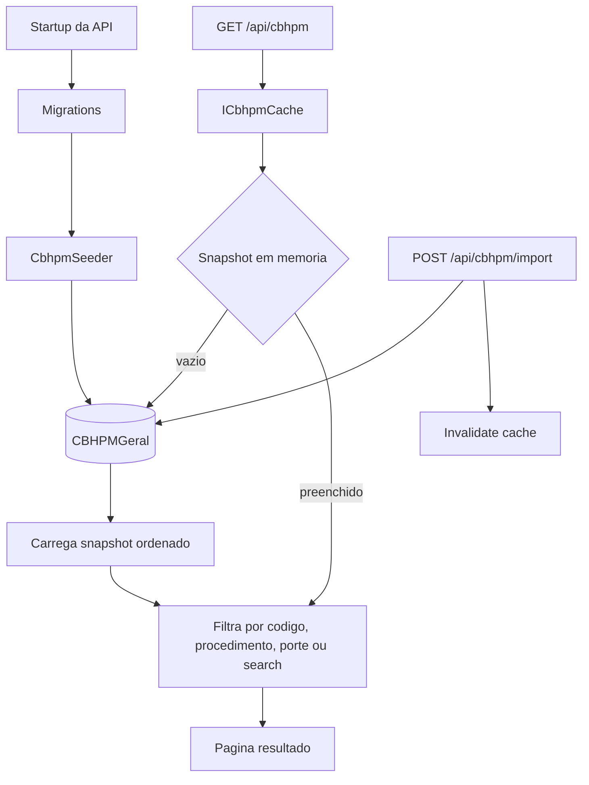
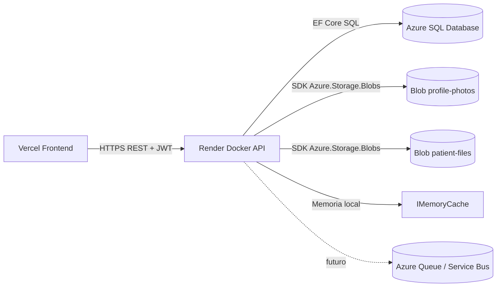

# Hemodinks - Documentacao Tecnica

## Visao geral

O Hemodinks e composto por frontend React/Vite, API ASP.NET Core/.NET 10, persistencia em SQL Server/Azure SQL e armazenamento de arquivos em Azure Blob Storage. A API foi organizada em Clean Architecture pragmatica com CQRS, MediatR, validacao em pipeline, EF Core e Minimal APIs.

URLs principais:

| Recurso | URL |
| --- | --- |
| Frontend local | `http://localhost:5173` |
| Frontend producao | `https://hemodinks-saude.vercel.app` |
| Frontend homologacao | `https://hemodinks-homologacao.vercel.app` |
| API local | `http://localhost:5000` |
| Swagger | `/swagger` |
| Scalar | `/scalar` |
| OpenAPI JSON | `/openapi/v1.json` |

## Projetos e responsabilidades

| Projeto | Responsabilidade |
| --- | --- |
| `HemodinksAPI.Domain` | entidades, constantes de dominio e utilitarios puros |
| `HemodinksAPI.Application` | commands, queries, handlers, DTOs, validadores, contratos e regras de aplicacao |
| `HemodinksAPI.Infrastructure` | EF Core, migrations, seeders, JWT, storage, notificacoes, worker de agenda e implementacoes concretas |
| `HemodinksAPI.Api` | Minimal APIs, CORS, autenticacao/autorizacao, Swagger/Scalar, DI e composition root |
| `HemodinksAPI.Tests` | testes unitarios e de integracao |

Direcao permitida:



## Componentes



## MER principal



## Fluxo HTTP e CQRS



## Fluxo de agenda



Notas:

- A agenda usa `NextReminderAt` para consultar apenas pendencias vencidas.
- O worker roda no proprio processo da API, adequado para Render Free e baixo custo inicial.
- O dashboard tenta processar pendencias sem bloquear a tela caso notificacoes falhem.
- A migration `EnsureEventReminderColumns` repara bancos que ja tinham `Events` sem colunas de lembrete.

## Fluxo de licencas



Features atuais:

- `Dashboard.Visualizar`
- `Pacientes.Visualizar`
- `Pacientes.Gerenciar`
- `Cbhpm.Consultar`

## Fluxo de CBHPM



## Comunicacao com Azure e Render



## Recursos externos

| Recurso | Status | Uso |
| --- | --- | --- |
| Azure SQL Database | usado | banco relacional da aplicacao |
| Azure Blob Storage | usado | fotos e anexos |
| Azure Queue Storage / Service Bus | nao usado | reservado para notificacoes/filas futuras |
| Render Worker separado | nao usado | worker atual roda dentro da API |

## Migrations e banco

Migrations ficam em `HemodinksAPI.Infrastructure/Data/Migrations`.

Comandos uteis:

```powershell
dotnet ef migrations list --project HemodinksAPI.Infrastructure --startup-project HemodinksAPI.Infrastructure --no-connect
dotnet ef database update --project HemodinksAPI.Infrastructure --startup-project HemodinksAPI.Infrastructure
```

O startup da API executa `Database.MigrateAsync()` automaticamente em bancos relacionais.

## Documentacao interativa

Swagger e Scalar sao servidos pela propria API:

- Swagger UI: `/swagger`
- Scalar UI: `/scalar`
- OpenAPI JSON usado pelo Scalar: `/openapi/v1.json`
- Swagger JSON: `/swagger/v1/swagger.json`

Os endpoints estao agrupados por tags:

- `Dashboard`
- `Usuarios`
- `Pacientes`
- `Agenda`
- `Licencas`
- `CBHPM`
- `Hospitais`
- `Convenios`

## Observacoes operacionais

- `IMemoryCache` reduz leituras repetidas da tabela CBHPM, mas e cache local por instancia.
- Azure SQL e Blob Storage sao recursos externos cobrados conforme plano/uso.
- O processamento de lembretes atual nao exige Hangfire, RabbitMQ, Azure Queue ou Service Bus.
- Para escala horizontal ou notificacoes reais em alto volume, o proximo passo natural e trocar o worker interno por fila/worker externo mantendo os contratos da Application.
