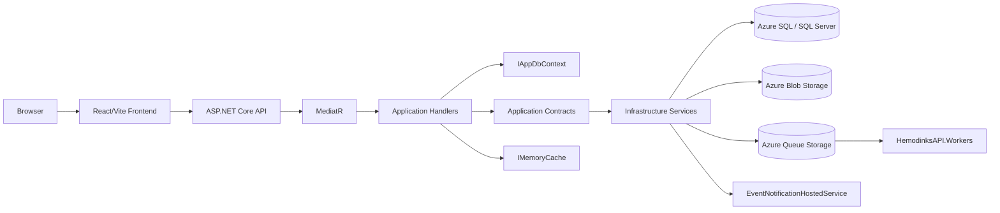
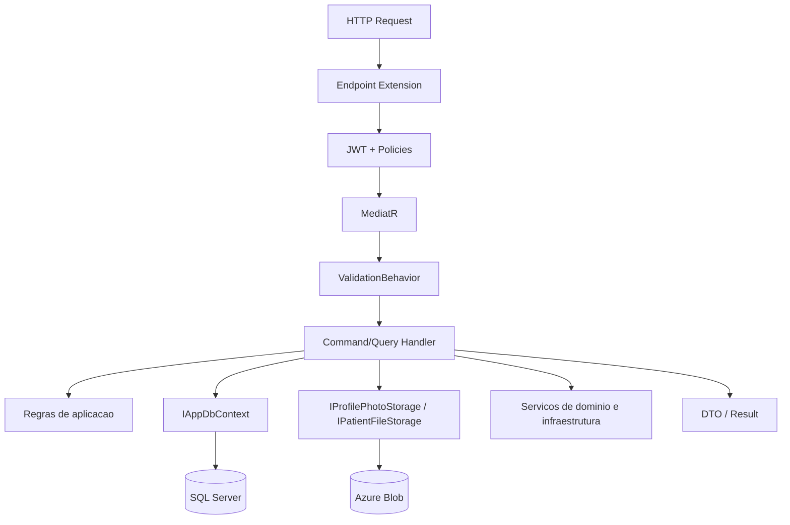
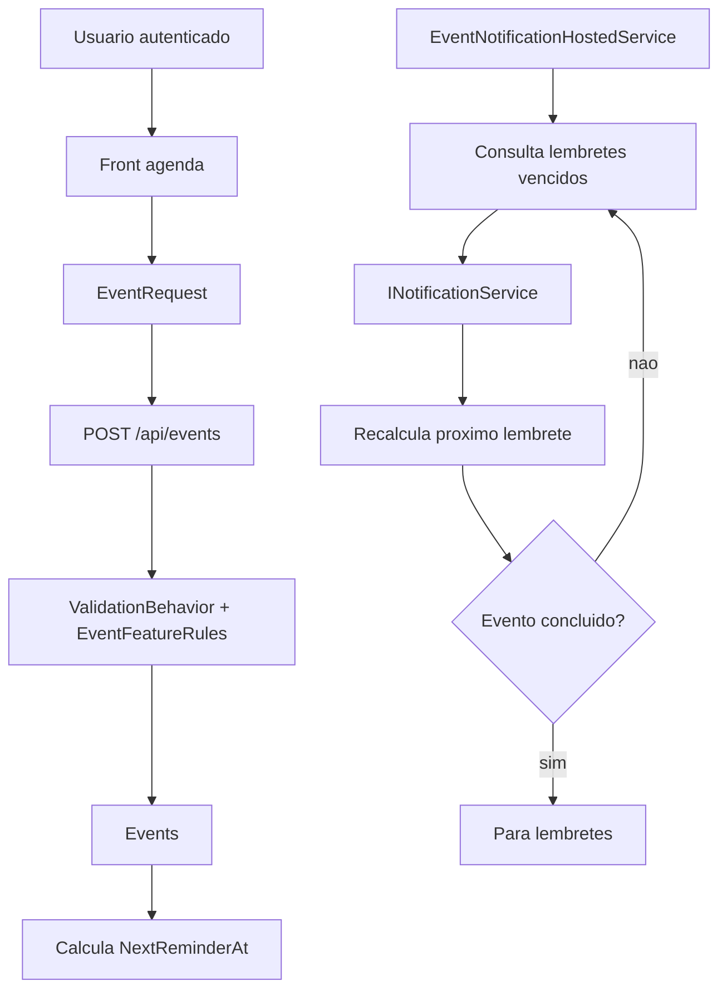
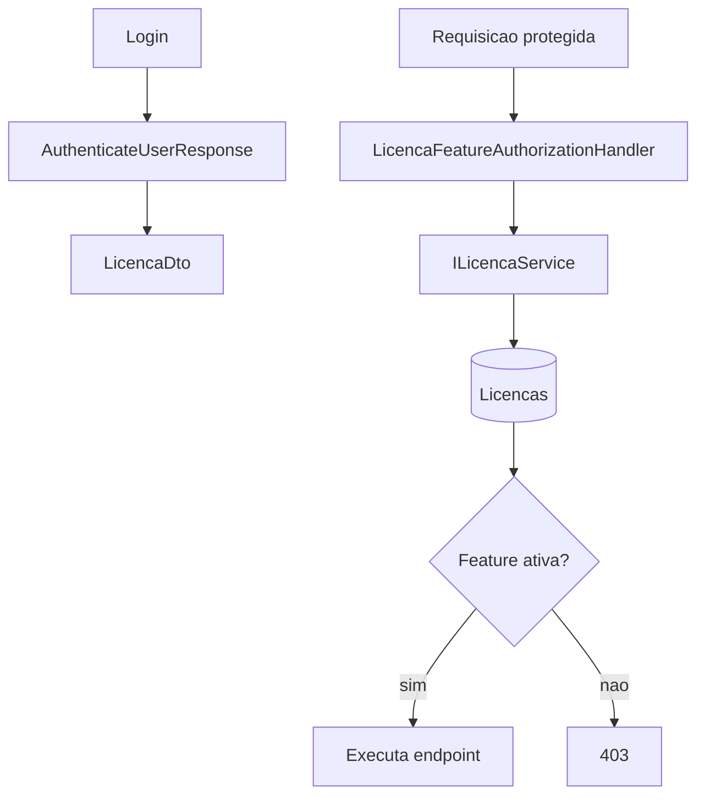
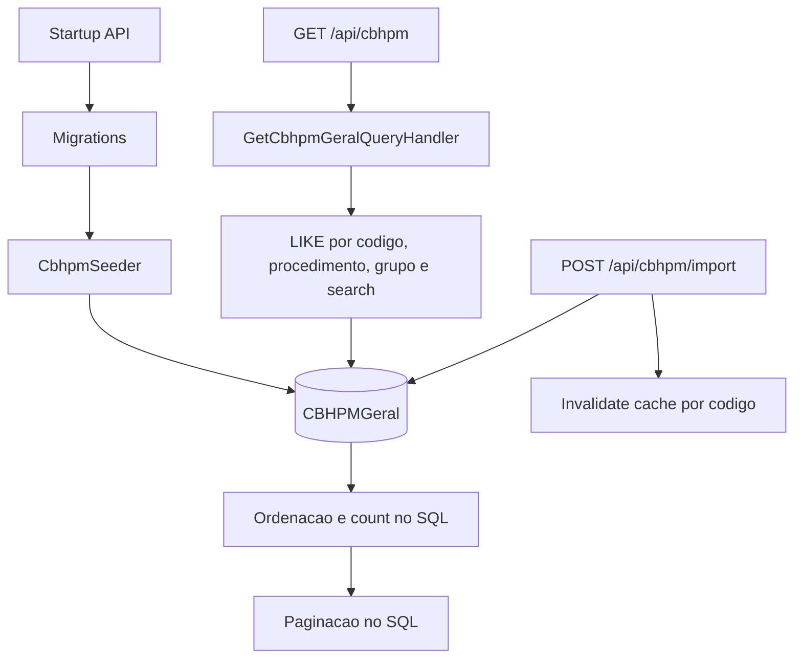

# Hemodinks - Documentacao Tecnica

## Visao geral

O Hemodinks combina frontend React/Vite, API ASP.NET Core/.NET 10, SQL Server/Azure SQL, Azure Blob Storage e componentes opcionais de fila/Functions para reset de senha e exportacoes. A API segue Clean Architecture pragmatica com CQRS, MediatR, validacao em pipeline, EF Core, Minimal APIs, JWT e politicas por perfil/licenca.

URLs principais:

| Recurso | URL |
| --- | --- |
| Frontend local | `http://localhost:5173` |
| Frontend producao | `https://hemodinks.gestao-saude.tec.br` |
| Frontend producao legado | `https://hemodinks-saude.vercel.app` |
| Frontend homologacao principal | `https://hemodinks-homologacao.gestao-saude.tec.br` |
| Frontend homologacao legado | `https://hemodinks-homologacao.vercel.app` |
| Frontend confirmation Render opcional | `https://hemodinks-front-confirmation.onrender.com` |
| API local | `http://localhost:5000` |
| Swagger local | `/swagger` |
| Scalar local | `/scalar` |
| OpenAPI JSON local | `/openapi/v1.json` |

Em ambiente publicado, as rotas de documentacao interativa exigem `ApiDocumentation__Enabled=true`.

## Projetos e responsabilidades

| Projeto | Responsabilidade |
| --- | --- |
| `HemodinksAPI.Domain` | entidades, constantes e utilitarios puros |
| `HemodinksAPI.Application` | commands, queries, handlers, DTOs, validadores, contratos e regras |
| `HemodinksAPI.Infrastructure` | EF Core, migrations, seeders, JWT, storage, notificacoes, filas e implementacoes concretas |
| `HemodinksAPI.Api` | Minimal APIs, auth, CORS, Swagger/Scalar e composition root |
| `HemodinksAPI.Workers` | Azure Functions para jobs assincronos |
| `HemodinksAPI.Tests` | testes unitarios e de integracao |

## Componentes


```mermaid
flowchart LR
    Browser[Browser] --> Front[React/Vite Frontend]
    Front --> API[ASP.NET Core API]
    API --> Mediator[MediatR]
    Mediator --> Handlers[Application Handlers]
    Handlers --> DbContext[IAppDbContext]
    Handlers --> Contracts[Application Contracts]
    Contracts --> Infra[Infrastructure Services]
    Infra --> Sql[(Azure SQL / SQL Server)]
    Infra --> Blob[(Azure Blob Storage)]
    Infra --> Queue[(Azure Queue Storage)]
    Queue --> Functions[HemodinksAPI.Workers]
    Infra --> Worker[EventNotificationHostedService]
    Handlers --> Cache[IMemoryCache]
```

## Modulos funcionais

### Usuarios e autenticacao

- login JWT
- refresh token rotativo em cookie `HttpOnly`, com expiracao deslizante apos 30 minutos de inatividade
- renovacao de JWT, registro de atividade e revogacao de sessao no logout
- reset de senha por email/token
- reset administrativo com senha temporaria aleatoria e troca obrigatoria
- foto de perfil
- anexos do cadastro medico

### Pacientes e observacoes

- cadastro clinico/administrativo
- procedimentos CBHPM
- anexos
- observacoes com resposta e leitura
- vinculo com usuario do perfil Paciente

### Dashboard

- resumo operacional
- notificacoes da agenda
- observacoes nao lidas
- indicadores condicionados por licenca

### Agenda e notificacoes

- CRUD de eventos
- destinatarios permitidos por usuario/grupo
- notificacao para usuario, perfil medico e grupos medicos
- lembretes com `NextReminderAt`

### Faturamento medico

- leitura agregada do faturamento
- escopo por perfil
- totais, glosas, convenios e checklist

### Grupos medicos

- CRUD de grupos
- membros medicos por escopo
- apoio a notificacoes da agenda

### Configuracao do sistema

- nome da empresa
- foto da empresa
- endpoint publico para login e branding do front

### Licencas

- trial
- plano completo
- liberacao de features por medico

### CBHPM

- consulta paginada
- importacao administrativa
- cache em memoria

### Exportacoes assincronas

- endpoint `POST /api/exports`
- filas opcionais
- processamento no `HemodinksAPI.Workers`

## Perfis e escopo

| Id | Perfil | Escopo principal |
| --- | --- | --- |
| 1 | Administrador | gestao completa |
| 2 | Medicos | agenda, pacientes vinculados, faturamento proprio, meu cadastro |
| 3 | Paciente | proprio cadastro quando vinculado |
| 4 | Controller | pacientes, faturamento e operacoes liberadas por policy |

Features de licenca atuais:

- `Dashboard.Visualizar`
- `Pacientes.Visualizar`
- `Cbhpm.Consultar`

## Fluxos principais

### Fluxo HTTP e CQRS


```mermaid
flowchart TB
    Request[HTTP Request] --> Endpoint[Endpoint Extension]
    Endpoint --> Auth[JWT + Policies]
    Auth --> Mediator[MediatR]
    Mediator --> Validation[ValidationBehavior]
    Validation --> Handler[Command/Query Handler]
    Handler --> Rules[Regras de aplicacao]
    Handler --> Db[IAppDbContext]
    Handler --> Storage[IProfilePhotoStorage / IPatientFileStorage]
    Handler --> Services[Servicos de dominio e infraestrutura]
    Db --> Sql[(SQL Server)]
    Storage --> Blob[(Azure Blob)]
    Handler --> Response[DTO / Result]
```

### Fluxo de agenda e notificacoes


```mermaid
flowchart TD
    User[Usuario autenticado] --> Calendar[Front agenda]
    Calendar --> Payload[EventRequest]
    Payload --> Create[POST /api/events]
    Create --> Validate[ValidationBehavior + EventFeatureRules]
    Validate --> Persist[Events]
    Persist --> Next[Calcula NextReminderAt]
    Worker[EventNotificationHostedService] --> Due[Consulta lembretes vencidos]
    Due --> Notify[INotificationService]
    Notify --> Recalc[Recalcula proximo lembrete]
    Recalc --> Complete{Evento concluido?}
    Complete -- nao --> Due
    Complete -- sim --> Stop[Para lembretes]
```

### Fluxo de observacoes do paciente

```mermaid
flowchart TD
    Screen[Modal de observacoes] --> List[GET /api/pacientes/{id}/observacoes]
    Screen --> Create[POST /api/pacientes/{id}/observacoes]
    List --> Read[POST /api/pacientes/{id}/observacoes/marcar-lidas]
    Create --> Rules[PacienteObservacaoRecipients]
    Rules --> Db[(Observacoes)]
```

### Fluxo de licencas


```mermaid
flowchart TD
    Login[Login] --> UserData[AuthenticateUserResponse]
    UserData --> Licenca[LicencaDto]
    Request[Requisicao protegida] --> Policy[LicencaFeatureAuthorizationHandler]
    Policy --> Service[ILicencaService]
    Service --> Db[(Licencas)]
    Db --> Allow{Feature ativa?}
    Allow -- sim --> Endpoint[Executa endpoint]
    Allow -- nao --> Forbidden[403]
```

### Fluxo de CBHPM


```mermaid
flowchart TD
    Startup[Startup API] --> Migration[Migrations]
    Migration --> Seed[CbhpmSeeder]
    Seed --> Table[(CBHPMGeral)]
    Request[GET /api/cbhpm] --> Handler[GetCbhpmGeralQueryHandler]
    Handler --> Filter[LIKE por codigo, procedimento, grupo e search]
    Filter --> Table
    Table --> Sort[Ordenacao e count no SQL]
    Sort --> Pagination[Paginacao no SQL]
    Import[POST /api/cbhpm/import] --> Table
    Import --> Invalidate[Invalidate cache por codigo]
```

## Persistencia

Entidades principais:

- `Perfis`
- `Users`
- `UserArquivos`
- `Licencas`
- `Pacientes`
- `PacienteArquivos`
- `PacienteProcedimentos`
- `Observacoes`
- `AgendaNotifications`
- `Events`
- `Hospitais`
- `Convenios`
- `Opmes`
- `FaturamentosMedicos`
- `GrupoMedicos`
- `GrupoMedicoUsuarios`
- `ConfiguracoesSistema`
- `PasswordResetTokens`
- `IdempotencyRequests`
- `CBHPMGeral`

Migrations ficam em `HemodinksAPI.Infrastructure/Data/Migrations` e podem ser validadas com:

```powershell
dotnet tool restore
pwsh ./scripts/Test-Migrations.ps1
dotnet tool run dotnet-ef migrations list --project HemodinksAPI.Infrastructure --startup-project HemodinksAPI.Api --no-connect
```

## Recursos externos

| Recurso | Status | Uso |
| --- | --- | --- |
| Azure SQL Database | usado | banco relacional da aplicacao |
| Azure Blob Storage | usado | fotos, anexos e arquivos exportados |
| Azure Queue Storage | opcional | reset por email e jobs de exportacao |
| Azure Functions | opcional | projeto `HemodinksAPI.Workers` |
| New Relic APM | opcional | telemetria APM da API |
| Worker Render separado | nao usado | lembretes atuais rodam no `BackgroundService` interno |

## Documentacao interativa

Swagger e Scalar sao servidos pela propria API:

- Swagger UI: `/swagger`
- Scalar UI: `/scalar`
- OpenAPI JSON: `/openapi/v1.json`
- Swagger JSON: `/swagger/v1/swagger.json`

Tags atuais do documento OpenAPI:

- `Users`
- `Pacientes`
- `Dashboard`
- `Agenda e notificacoes`
- `Faturamento medico`
- `GruposMedicos`
- `ConfiguracoesSistema`
- `Licencas`
- `CBHPM`
- `Hospitais`
- `Convenios`
- `OPME`
- `Exports`

## Observacoes operacionais

- `IMemoryCache` de CBHPM e local por instancia
- `EventNotificationHostedService` e o worker atual de lembretes
- configuracao do sistema e anonima para permitir branding no login do front
- exportacoes e reset por email podem sair da API para filas/Functions sem mover auth e regras de negocio
